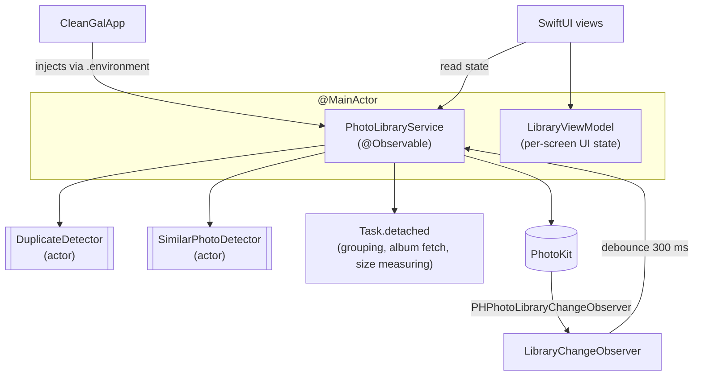

[README.md](https://github.com/user-attachments/files/33103293/README.md)
# CleanGal

A native iOS app that helps you reclaim space in your photo library. It browses your photos and videos, and finds **exact duplicates**, **visually similar photos** and **the largest videos**, so you can review them and delete what you don't need.

Built with **Swift**, **SwiftUI** and **PhotoKit**. Everything runs **on-device**: no server, no account, no network calls.

<!-- Add screenshots here, e.g.  -->

---

## Contents

1. [Features at a glance](#features-at-a-glance)
2. [Requirements and running the project](#requirements-and-running-the-project)
3. [Architecture](#architecture)
4. [Algorithms](#algorithms)
5. [Techniques and frameworks used](#techniques-and-frameworks-used)
6. [How each feature works](#how-each-feature-works)
7. [Performance and memory decisions](#performance-and-memory-decisions)
8. [Privacy and safety](#privacy-and-safety)
9. [Project structure](#project-structure)
10. [Known limitations and future work](#known-limitations-and-future-work)

---

## Features at a glance

| Area | What it does |
|---|---|
| **Library** | Photos-style grid grouped by day, pinch to change column count, multi-select, share and delete |
| **Media viewer** | Swipe between items, pinch/double-tap zoom, video playback, info sheet (EXIF, file details, map), share, delete |
| **Albums** | System albums (Screenshots, Videos, Selfies, Live Photos, Portrait, Panoramas, Slo-mo, Time-lapse, Favorites) and the user's own albums shown as large cover cards |
| **Duplicate Images / Videos** | Finds byte-identical copies using a two-pass size-then-hash algorithm |
| **Similar Photos** | Finds near-identical shots (bursts, retakes) using colour histograms plus Vision feature prints |
| **Large Videos** | Lists every video, biggest first, with a size bar relative to the largest |
| **Review and delete** | For each group, shows size, date and resolution; the user chooses what to keep; the rest is deleted in one action |

---

## Requirements and running the project

- Xcode 16 or later, iOS 18 or later (uses the `Tab` API and zoom navigation transitions)
- A device or simulator with photos in the library. A real device with a real library gives the most meaningful results
- The target needs the `NSPhotoLibraryUsageDescription` key in its Info settings

1. Open the project in Xcode.
2. Select an iOS 18+ device or simulator and run.
3. Allow photo access when prompted.
4. Open the **Albums** tab. The cleaning tools are in the **Utilities** section.

---

## Architecture

The app uses SwiftUI with the Observation framework (`@Observable`). One shared service owns all PhotoKit work, and small per-screen view models hold UI state.



| Component | Responsibility |
|---|---|
| `PhotoLibraryService` | Single source of truth. Authorisation, fetching, thumbnail/full image loading and caching, video player items, EXIF, albums, large videos, deletion, sharing, and orchestration of the scanners. Publishes scan results and `isScanning` / `hasScanned` flags |
| `LibraryViewModel` | Lightweight UI state per screen: selection mode, selected IDs, grid column count, navigation path |
| `DuplicateDetector` (actor) | Exact duplicate detection, off the main thread |
| `SimilarPhotoDetector` (actor) | Similar photo detection. Receives `CGImage`s, so it has no PhotoKit dependency and is easy to reason about in isolation |
| `LibraryChangeObserver` | Receives `PHPhotoLibraryChangeObserver` callbacks from a background queue and triggers a debounced reload |

---

## Algorithms

### 1. Exact duplicate detection (`DuplicateDetector`)

Goal: find files that are byte-for-byte the same, without reading every file in full.

**Pass 1: structural bucketing, zero file I/O, O(n)**

Each asset is placed in a hash-map bucket keyed by metadata that PhotoKit already knows:

- images: `width x height _ fileSize`
- videos: `width x height _ duration _ fileSize`

Any bucket with a single item cannot contain a duplicate and is discarded immediately. For a typical library this removes the vast majority of assets before any file is opened.

**Pass 2: sampled SHA-256 fingerprint, only for surviving candidates**

The resource is streamed through `PHAssetResourceManager`, and a SHA-256 (CryptoKit) is computed over **three 256 KB windows: the start, the middle and the end** of the file. Files of 768 KB or less are hashed completely. A custom `SampledHasher` tracks the byte offset of each arriving chunk and feeds only the overlapping slices into the hash.

Assets in the same bucket with the same fingerprint form a duplicate group. Hashes are only compared *within* a bucket, so a coincidental hash match across different sizes can never merge groups.

**Why this design**
- Comparing size first is the classic way to avoid hashing files that cannot match.
- Sampling start, middle and end (instead of only the start) protects against files that share a header but differ later, such as videos with identical container metadata.
- iCloud-only assets are skipped (`isNetworkAccessAllowed = false`) so a scan never triggers large downloads.
- Assets whose size cannot be read are skipped, because they cannot be verified safely.

### 2. Similar photo detection (`SimilarPhotoDetector` + `PhotoLibraryService`)

Goal: group photos that look alike (burst shots, retakes) even though the files are different.


**Step 1: time-neighbour pre-filter.** Photos are sorted by creation date. A photo is kept only if another photo was taken within one hour of it. Photos with no neighbour can never be grouped, so they are never analysed. Cost: O(n log n).

**Step 2: bounded-concurrency loading.** A `TaskGroup` loads small (360 px) local thumbnails, with at most 4 loads in flight. While the next thumbnails load, the detector actor runs Vision on earlier ones, so image loading and analysis overlap without flooding memory.

**Step 3: two signatures per photo.**

1. *Colour signature (cheap).* The image is downsampled to 32 x 32 and split into a 2 x 2 grid. Each quadrant gets a 64-bin RGB histogram (4 levels per channel), normalised so each quadrant sums to 1. This gives 256 values that capture both the palette and where colours sit in the frame.
2. *Semantic signature.* `VNGenerateImageFeaturePrintRequest` from the Vision framework produces a feature print, a neural-network embedding describing what is in the image.

**Step 4: pairwise test.** A pair is "similar" only if it passes **both** checks:

- colour similarity (histogram intersection, averaged over the four quadrants) is at least **0.70**. This is checked first because it is much cheaper than Vision comparison.
- feature-print distance (`computeDistance`) is below **6.0**.

Using both avoids a known weakness of feature prints alone: they describe the *kind* of subject (food, a face, a street), so unrelated photos of the same kind of subject can look close. Requiring matching colour and layout removes most of those false positives.

**Step 5: anchor-based clustering (no chaining).** Photos are processed in date order. Each unassigned photo becomes the *anchor* of a new group, and later photos within the time window join only if they match **the anchor directly**.

This deliberately replaces a union-find / connected-components approach. Union-find links A~B and B~C into one group even when A and C look nothing alike (the "chaining" problem). Anchor-based grouping prevents that drift. Because photos are sorted by time, the inner loop stops as soon as a candidate falls outside the window, so the practical cost is roughly O(n x k) where k is the number of photos inside one window, rather than O(n²).

The thresholds (`6.0`, `0.70`, `1 hour`) are named constants at the top of `SimilarPhotoDetector` and were tuned empirically.

### 3. Large video detection (`PhotoLibraryService.loadLargeVideos`)

- Fetches all videos with a `PHFetchOptions` predicate (`mediaType == video`).
- Measures each video's storage by summing the byte size of its `.video` and `.fullSizeVideo` resources. An edited video keeps both the original and the rendered edit on disk, so both count.
- Sizes are cached per asset identifier, so re-entering the screen only measures videos not seen before. A failed (zero) lookup is never cached.
- Results are sorted by size, descending. Each row draws a bar showing its size as a fraction of the largest video.
- All measuring runs off the main thread.

### 4. "Keep the best" selection (`DuplicateReviewView`)

When a group is shown, one item is chosen to keep and the others are pre-marked for deletion. "Best" is decided by a lexicographic comparison:

1. a **favourited** item beats a non-favourite
2. otherwise the **larger file** wins
3. otherwise the **earlier** (original) item wins

The user can override any choice. A group always keeps at least one item: marking the last remaining item is refused with haptic feedback.

### 5. Debounced change handling

Photos often sends several change notifications for one action (for example a single delete). `scheduleReload()` cancels any pending reload and starts a new 300 ms timer, so several notifications collapse into one reload. After the reload, cached scan results are **pruned**: deleted identifiers are removed, and any group left with fewer than two items is dropped.

---

## Techniques and frameworks used

| Technique | Where it is used |
|---|---|
| **SwiftUI + Observation** (`@Observable`, `@Environment`, `@State`) | App state and every screen |
| **Swift Concurrency**: `async/await`, `actor`, `TaskGroup`, `Task.detached`, cooperative cancellation | Scanners, background fetching, bounded-concurrency thumbnail loading |
| **`@MainActor` isolation and `nonisolated` helpers** | UI state stays on main; heavy enumeration and grouping run off it |
| **Bridging callbacks to async** with `withCheckedContinuation` | `PHImageManager`, `PHAssetResourceManager`, player items |
| **PhotoKit**: `PHAsset`, `PHFetchOptions`, `PHAssetCollection`, `PHAssetResource`, `PHCachingImageManager`, `PHPhotoLibrary.performChanges`, `PHPhotoLibraryChangeObserver` | Library access, albums, deletion, live updates |
| **Vision**: `VNGenerateImageFeaturePrintRequest` | Semantic similarity |
| **CryptoKit**: SHA-256 | Duplicate fingerprints |
| **Core Graphics**: `CGContext` downsampling | Colour histogram signature |
| **ImageIO**: `CGImageSource` | EXIF extraction (aperture, ISO, focal length, shutter speed, camera and lens) |
| **AVKit / AVFoundation** | Video playback with autoplay on the active page only |
| **MapKit** | Location preview in the info sheet |
| **UIKit interop** (`UIViewRepresentable`, `UIScrollView`) | Smooth pinch and double-tap zoom with a coordinator for gestures |
| **UIKit sharing** (`UIActivityViewController`, `UIActivityItemSource`, `LinkPresentation`) | Share sheet with a ready-made title and thumbnail |
| **`NSCache`** with cost limit | Bounded thumbnail cache |
| **Lazy containers** (`LazyVGrid`, `LazyHStack`, `LazyVStack`) | Scrolling large libraries |
| **Paging scroll** (`scrollTargetBehavior(.paging)`, `scrollPosition(id:)`) | Swiping through media |
| **Zoom navigation transition** (`matchedTransitionSource`, `.navigationTransition(.zoom)`) | Photos-style open and close animation |
| **Magnify gesture** (`MagnifyGesture`) | Pinch to change the grid column count (1 to 7) |
| **Apple Human Interface Guidelines** | Native navigation, toolbars, grouped lists, SF Symbols, confirmation dialogs, system delete prompt |

---

## How each feature works

### Library tab
- Assets are fetched oldest-first, then grouped by calendar day on a background task and published as date sections. Section titles read "Today", "Yesterday", a weekday and date, or a full date for older years.
- The grid opens scrolled to the newest photo.
- Pinch zoom changes the column count between 1 and 7.
- **Select** mode adds Select All, Share and Delete, and hides the tab bar so the bottom toolbar has room.
- Tapping a cell pushes the media viewer through a `NavigationPath` stored in the view model.

### Media viewer
- A horizontal paging `ScrollView` with a lazy stack; the current page is tracked with `scrollPosition(id:)`.
- **Two-stage image loading:** a cached thumbnail shows instantly during the zoom transition, then is swapped for the full-resolution image when it arrives.
- **Preloading:** a window of ±4 items around the current page is cached through `PHCachingImageManager`, and caching stops when the viewer closes.
- Videos play with `AVPlayer`, starting only on the active page and pausing when it is swiped away.
- The top-right toolbar has Share, Info and Delete. Tapping the media toggles the controls and status bar.
- **Info sheet:** resolution, megapixels, colour model, file size and format, camera, lens and exposure data (from EXIF), date, coordinates and a map.

### Albums tab
- **Utilities:** four tiles (Duplicate Images, Duplicate Videos, Similar Photos, Large Videos), each showing its status or result count.
- **Media Types** and **My Albums:** large square cover cards, as in the Photos app. Empty albums are hidden.
- Album covers are loaded with a self-sizing view, so cards adapt to any screen width.

### Duplicate Images, Duplicate Videos and Similar Photos
1. Opening the screen starts the scan if it has not run yet, with a progress view. Results are kept, so reopening is instant.
2. Results appear as group cards. Each item shows its size, date and time, and resolution.
3. The circle on each item toggles **Keep** (green badge) or **Delete** (red tint). Tapping the picture itself opens it in the viewer.
4. The bottom bar shows how many items are selected and how much space they free. The `...` menu offers "Keep Best in Each Group" and "Deselect All".
5. **Delete** asks for confirmation, then the system asks for permission. Items go to Recently Deleted, and the result list updates immediately.

### Large Videos
Shows a count and total size, then each video biggest-first with a proportional size bar. It supports select and delete, and re-measures only new videos when reopened.

### Deleting
Deletion uses `PHPhotoLibrary.performChanges` on a non-main-actor context. A user cancel is handled silently. Any other failure (for example missing permission or no network for an iCloud item) is shown as an alert with a readable message.

### Sharing
Selected items are exported to uniquely named temporary folders, using the edited version when one exists and keeping the original file name. The share sheet receives file URLs instead of full-resolution images held in memory. The temporary files are removed when the share sheet finishes, and leftovers from a previous session are cleared at launch.

---

## Performance and memory decisions

- **Cheap checks first.** Both scanners filter by inexpensive metadata (size, time window, colour histogram) before doing expensive work (hashing, Vision).
- **Off the main thread.** Grouping, album enumeration, size measuring, hashing and Vision all run in background tasks or actors. The UI only receives finished results.
- **Bounded concurrency.** At most 4 thumbnail loads run at once during a similar-photo scan.
- **Bounded cache.** Thumbnails live in an `NSCache` with a decoded-size limit (about 96 MB) that the system also evicts under memory pressure. Only the largest version seen per asset is kept, and a small cached image is never reused for a larger grid cell.
- **Results are reused.** Scan results and measured video sizes are cached, and reopening a screen does not repeat work.
- **No full-size images for sharing.** Files are exported instead of decoded into memory.
- **Cancellation aware.** If a scan is cancelled (the user leaves the screen), partial results are not published, so the scan runs again next time.

---

## Privacy and safety

- All analysis happens locally on the device. Vision runs on-device, and no photo data leaves the phone.
- Scans never download from iCloud.
- Nothing is deleted without two steps: the user's explicit selection plus an in-app confirmation, and then the system's own delete prompt.
- Deleted items go to the system **Recently Deleted** album, so they can be recovered for the usual retention period.
- Every duplicate or similar group is guaranteed to keep at least one item.

---

## Project structure

```
CleanGal/
├── CleanGalApp.swift            App entry, creates and injects PhotoLibraryService
├── ContentView.swift            Tab bar (Library, Albums) and delete-error alert
│
├── Services/
│   ├── PhotoLibraryService.swift   PhotoKit, caching, albums, large videos, delete, share
│   ├── DuplicateDetector.swift     Exact duplicates: size bucketing + sampled SHA-256
│   └── SimilarPhotoDetector.swift  Similar photos: histogram + Vision feature print + clustering
│
├── ViewModels/
│   └── LibraryViewModel.swift      Selection, grid zoom, navigation state
│
├── Views/
│   ├── LibraryView.swift           Date-sectioned grid, selection toolbar
│   ├── AlbumsView.swift            Utilities tiles, album cards, scan screens
│   ├── AlbumDetailView.swift       Grid for one album, select and delete
│   ├── LargeVideosView.swift       Videos by size with proportional bars
│   ├── DuplicateReviewView.swift   Group review: details, keep/delete, delete action
│   ├── MediaDetailView.swift       Paging viewer, toolbar, share, delete
│   ├── ZoomableImageView.swift     UIScrollView-based zoom, two-stage loading
│   ├── VideoPlayerView.swift       AVPlayer playback
│   ├── MediaInfoView.swift         EXIF and file info sheet
│   ├── ThumbnailView.swift         Reusable thumbnail with badge and selection overlay
│   └── ShareSheet.swift            UIActivityViewController wrapper and item source
│
└── Extensions/
    └── PHAsset+Extensions.swift    Identifiable conformance, duration formatting
```

---

## Known limitations and future work

- **Similarity thresholds are heuristic.** The feature-print scale is not documented by Apple, so the distance threshold was tuned by hand on sample data and may need adjusting for other libraries.
- **iCloud-only items are skipped** by the duplicate and similar scans, so users with "Optimise Storage" enabled may see fewer results.
- **Duplicate verification reads whole files.** Photos can only stream a resource from its start, so reaching the middle and end of a large candidate video means reading all of it. Only candidates that already match on size, duration and resolution pay this cost.
- **File size uses an undocumented key.** Sizes come from the `fileSize` value of `PHAssetResource`, which works in practice but is not part of the public API.
- **Scan results are pruned, not recomputed,** when the library changes. New photos are picked up on the next scan.
- **Large Videos measures sizes on the device.** An iCloud-only video frees iCloud storage rather than local space when deleted.
- **Possible extensions:** perceptual hashing (dHash/pHash) as a lighter alternative to feature prints, a "Recently Deleted" screen, background scanning, and unit tests for the clustering and selection logic.
